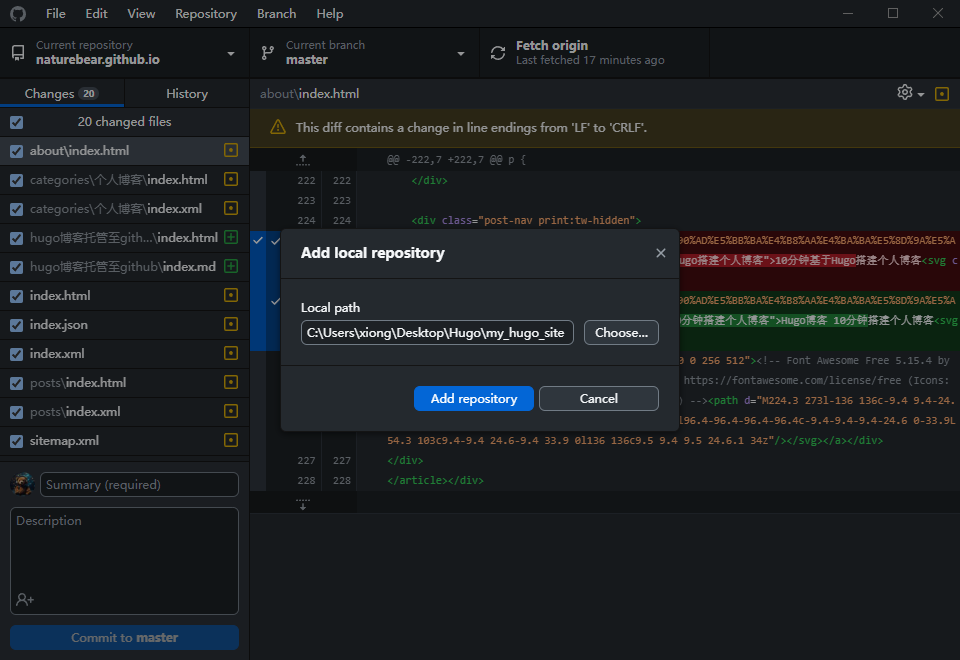
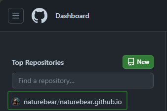
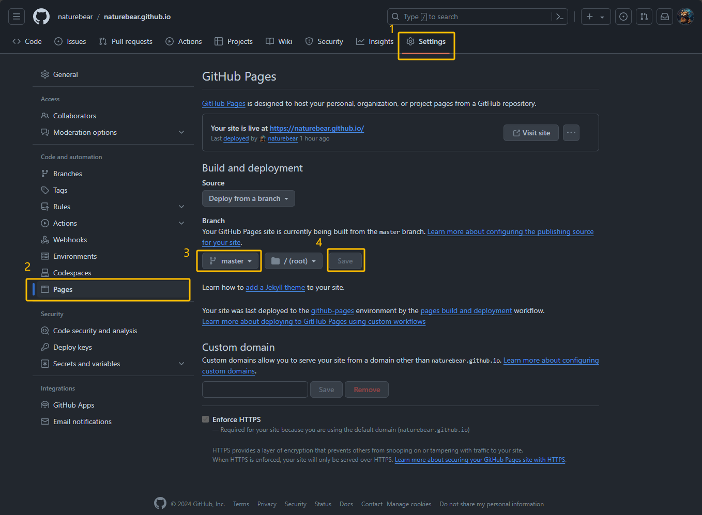

# Hugo博客 5分钟托管至Github


# <center>🚀 Hosting on Github Pages 🚀</center>

> 本文参考：
> [Hugo快速开始中文文档](https://www.gohugo.org/doc/overview/quickstart/) |
> [如何使用Hugo搭建博客并上传至GitHub](https://www.bilibili.com/video/BV1zu41187o4/?spm_id_from=333.337.search-card.all.click&vd_source=b45fab7bb020acbd989444bee3005fde)

## 第一步：初始化本地仓库
站点```my_hugo_site```目录下的```public```文件夹中存放了整个博客的所有静态页面。
1. 命令行进入```../my_hugo_site/public```目录。
2. 初始化git仓库：```git init```
3. 将当前目录下所有文件添加至暂存区：```git add .```
4. 将暂存区内所有文件提交至本地仓库：```git commit -m "init"```

## 第二步：将本地仓库添加至Github
1. 安装 [GitHub Desktop](https://desktop.github.com/)
2. 打开 GitHub Desktop，选择"File > Add local repository"，选择```my_hugo_site```所在路径，点击"Add repository"。



3. 点击"Publish repository"，填写 Name 和 Description，再次点击"Publish repository"即可将本地仓库同步至Github。
> ❗❗❗ 注意 Name **必须**为```Github用户名```+```.github.io```，例如本人Github用户名为"naturebear"，则填写内容为：```naturebear.github.io```

> ❗❗❗ 注意**不要勾选** ```Keep this code private```
4. 浏览器访问 [Github](https://github.com/)，查看仓库是否已上传成功。



## 第三步：配置 Github Pages 服务
- 进入博客仓库，选择"Settings > Pages"，在 Branch 中选择 master，点击 save 保存。



## 第四步：在浏览器中输入 [仓库名](https://naturebear.github.io) 访问自己的博客 🎉🎉🎉
