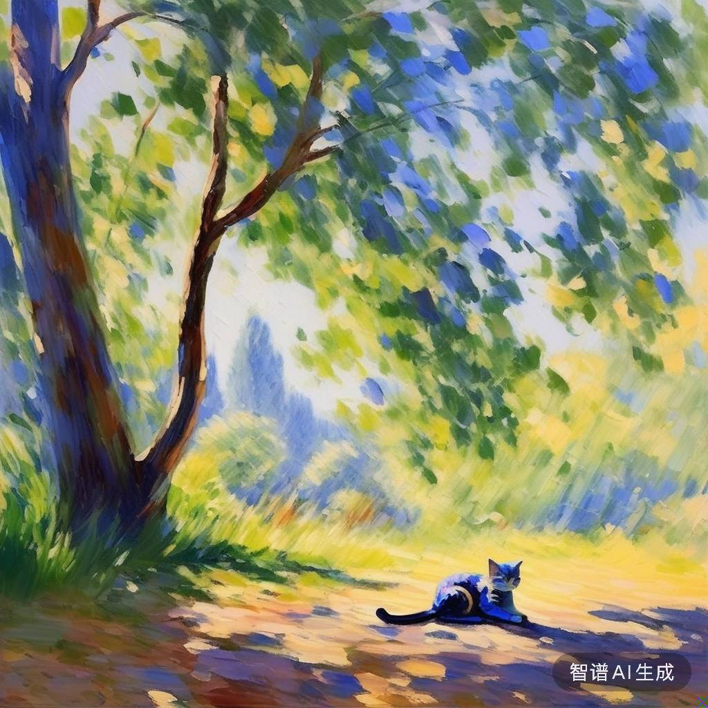

# Hugo博客 插入图片


# <center>🚀 在博文中优雅地插入图片 🚀</center>

> 本文参考：
> [Cassius's Blog](https://www.yuweihung.com/posts/2021/hugo-blog-picture/#:~:text=Hugo%20%E6%99%AE%E9%81%8D%E7%9A%84%E6%96%B0%E5%BB%BA%E5%8D%9A%E6%96%87%E7%9A%84%E6%96%B9%E5%BC%8F%E6%98%AF%20hugo%20new,posts%2Fnew-post.md%20%EF%BC%8C%E8%BF%99%E6%A0%B7%E6%88%91%E4%BB%AC%E5%8F%AF%E4%BB%A5%E5%B0%86%E5%9B%BE%E7%89%87%E9%83%BD%E5%AD%98%E6%94%BE%E5%9C%A8%20Blog%2Fstatic%2F%20%E7%9B%AE%E5%BD%95%E4%B8%8B%EF%BC%8C%E8%BF%99%E6%A0%B7%E7%BB%8F%E8%BF%87%E7%BC%96%E8%AF%91%E4%B9%8B%E5%90%8E%E5%9B%BE%E7%89%87%E4%BC%9A%E5%AD%98%E6%94%BE%E5%88%B0%E7%BD%91%E7%AB%99%E7%9A%84%E6%A0%B9%E7%9B%AE%E5%BD%95%E3%80%82)（采取随 markdown 源文件一起存储的方法在博文中插入图片）

## 创建文章
使用以下命令，创建一个新的博文目录，以及名为 index.md 的 markdown 文件，同时在博文目录下创建一个用于存放图片的目录 pics/。
```text
hugo new posts/new-post-name/index.md
cd new-post-name
mkdir pics
```

## 插入图片
1. 使用 markdown 命令在文章中插入图片
```markdown

```
2. 使用 HTML 在文章中插入图片
```html

```

## 添加图注
使用 Hugo 提供的 shortcodes 在插入图片同时添加图注：
```text
# 删除代码中的两个反斜杠"\"
\{\{< figure src="pics/example.png" width="80%" title="示例图片" >}}
```



